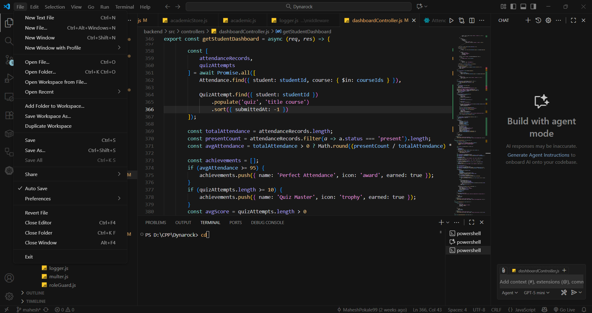

# Cursor Dark Theme for VS Code

Exact replica of the Cursor Dark theme for Visual Studio Code.

**Repository:** https://github.com/MaheshPokale99/cursor-dark-vscode-theme

## Features

- Beautiful dark color scheme matching Cursor IDE
- Perfect syntax highlighting for all languages
- Optimized for long coding sessions

## Screenshot

## Installation

1. Open VS Code
2. Go to Extensions (Ctrl+Shift+X)
3. Search for "Cursor Dark"
4. Click Install

## Usage

1. Press `Ctrl+Shift+P` (or `Cmd+Shift+P` on Mac)
2. Type "Preferences: Color Theme"
3. Select "Cursor Dark"

## License

MIT

